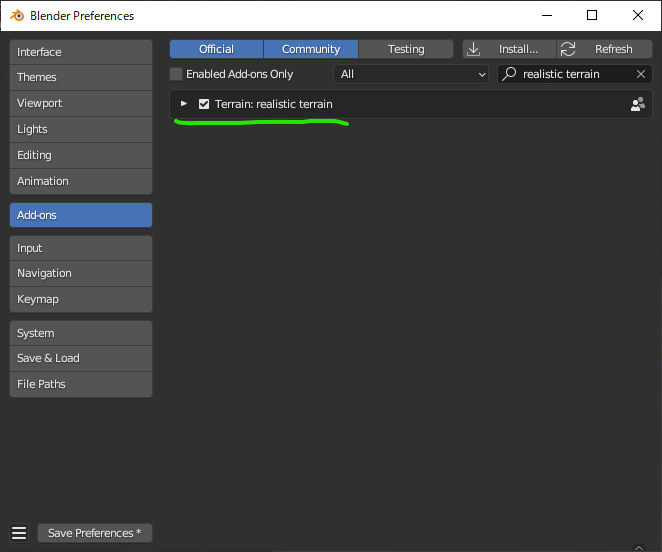
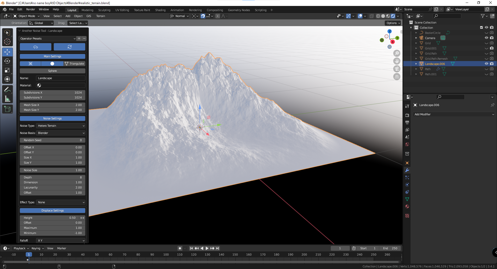
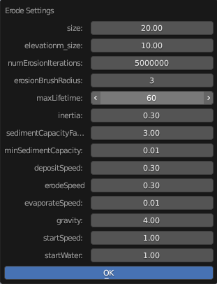
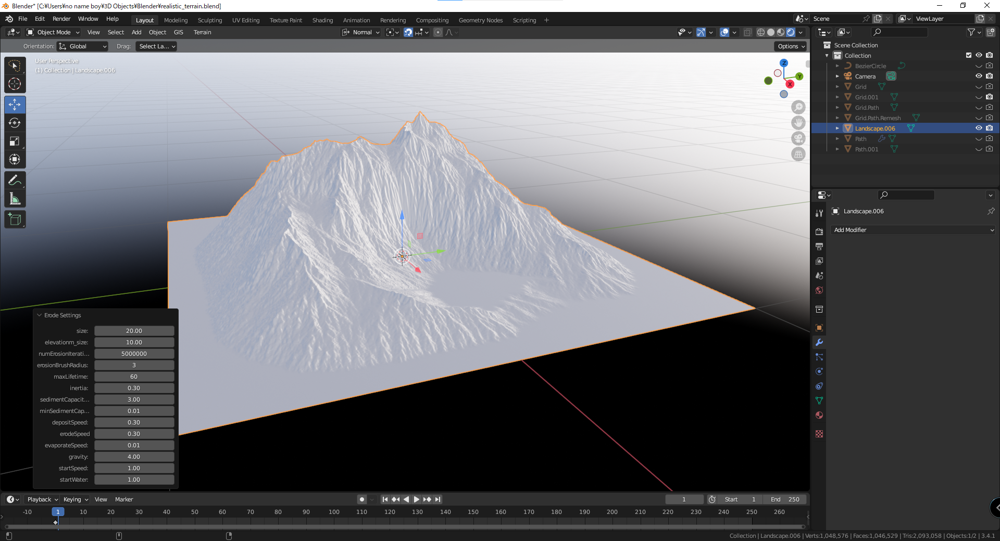
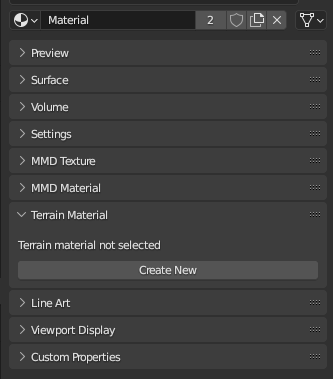
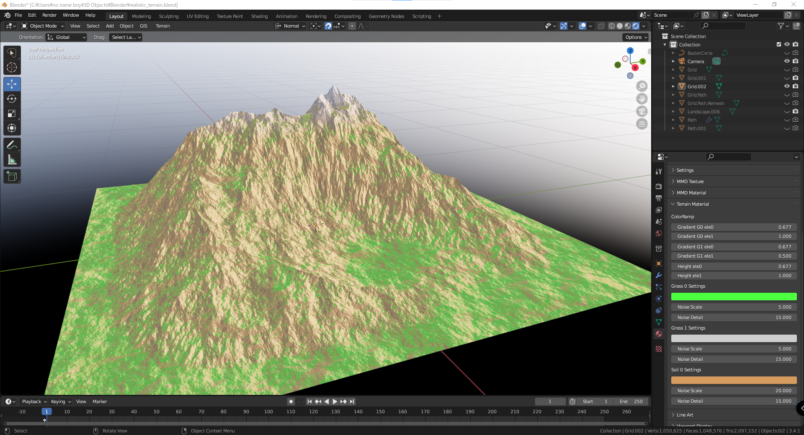
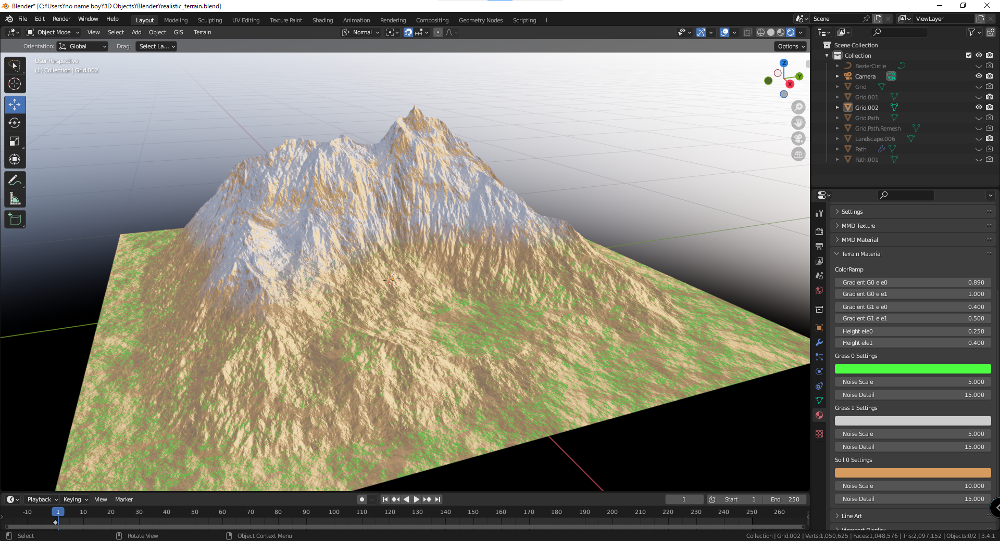

# Realistic Terrain
Add-on for Blender to simulate terrain using directx11 compute shader  
Provide simple terrain material

## Screenshot
</img>

## Requirements
- Windows10
- DirectX11
- Blender using Python 3.10.* (ex. Blender 3.4)
	- Numpy

## Note
<details>
All versions 1.2 and later will be distributed with the release.
If you have already installed version 1.1 or earlier, please deactivate and uninstall the already installed realistic terrain before installing version 1.2 or later.
If you cannot uninstall version 1.1 or earlier, delete the folder directly. Add-ons for version 1.1 or earlier should be located in the following directory  
``` C:\Users\{USER_NAME}\AppData\Roaming\Blender Foundation\Blender\3.4\scripts\addons\realistic-terrain-master ```
</details>

## Install
- Install 1.2 or later versions from release  
- Launch Blender and select the Zip file downloaded by Install from Edit/Preference/Add-ons  
</img>  
- Enable "realistic terrain"  
</img>  

## Tutorial
<details><summary>terrain representation combined with A.N.T.Landscape</summary>

1. Create an A.N.T. Landscape grid with a resolution of 1024x1024 (be sure to create the grid with NxN resolution)  
</img>
2. Run simulations from Terrain/Erode/Process  
</img>  
</img>
3. Create a grid with size 2.0 and resolution 1024x1024 from Terrain/Grid/Create (A.N.T. Landscape meshes are not UV expanded, and high-resolution grids take time to expand, so create a pre-expanded grid)  
4. Apply Shrinkwrap to copy grid vertex height information  
</img>
5. Select the grid from which the height information was copied and attach TerrainMaterial  
</img>  
</img>
6. Adjust parameters to complete  
</img>

</details>


## Reference
- [SebLague: Hydraulic-Erosion](https://github.com/SebLague/Hydraulic-Erosion)
- [Cartelet: Calculate perlin noise with numpy](https://qiita.com/Cartelet/items/9fcf3890a9ac59e1fd1f)
